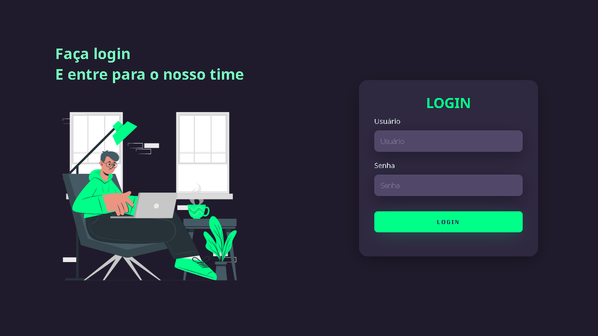
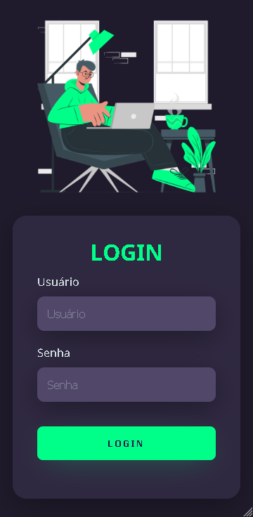

# Tela de Login Responsiva

Tela de login responsiva no tema dark usando HTML5 e CSS3

## Sumário
<!--ts-->
 * [Status](#sobre)
 * [Tecnologias utilizadas](#tecnologias-utilizadas)
 * [Versão Desktop](#versao-desktop)
 * [Versão Mobile](#versao-mobile)
<!--te-->
## Status

Desenvolvimento em progresso🔧

## Tecnologias Utilizadas
<ul>
  <li>HTML5</li>
  <li>CSS3</li>
</ul>
<h2>Versão Desktop</h2>

  

<h2>Versão Mobile</h2>

  

